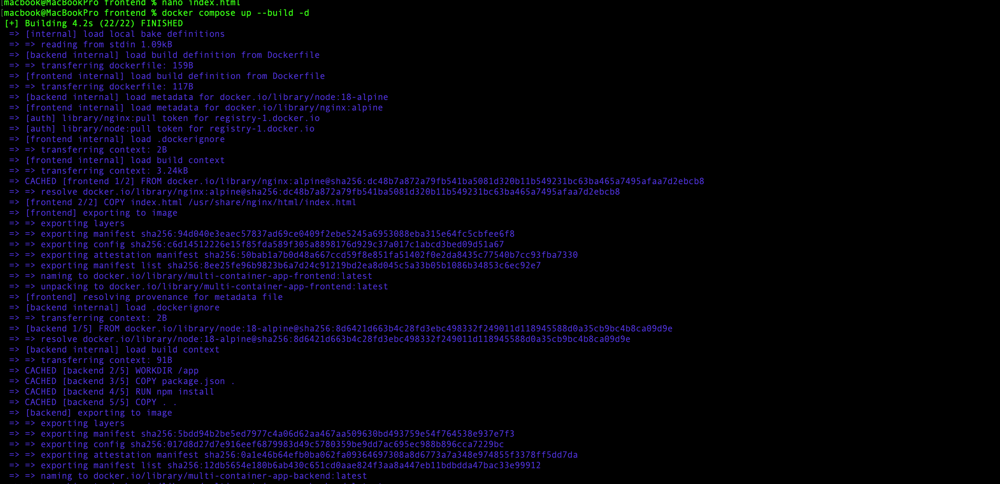

# multi-container-docker-app
A multi-container application using Docker Compose with frontend, backend API, and MongoDB database services.
# Multi-Container Docker Application

## Project Overview

This project demonstrates a multi-container application architecture using Docker Compose.

The application is separated into:

- Frontend service
- Backend API service
- MongoDB database service

Each service runs inside its own Docker container while Docker Compose orchestrates and connects all services together.

This project was built as part of a Cloud Engineering, DevOps, and DevSecOps learning roadmap.

---

# Architecture

```text
Browser
   ↓
Frontend Container (NGINX)
   ↓
Backend API Container (Node.js + Express)
   ↓
MongoDB Database Container

Technologies Used
Docker
Docker Compose
NGINX
Node.js
Express.js
MongoDB
Git & GitHub
Linux CLI

Services
Frontend

The frontend service is served using NGINX and acts as the user-facing layer of the application.

Backend API

The backend service uses Node.js and Express to simulate application logic and API functionality.

Database

MongoDB runs as a separate database container representing the persistence/data layer.

Docker Compose

Docker Compose was used to:

Build multiple containers
Start services together
Manage networking between services
Simplify orchestrati# Multi-Container Docker Application

## Project Overview

This project demonstrates a multi-container application architecture using Docker Compose.

The application is separated into:

* Frontend service
* Backend API service
* MongoDB database service

Each service runs inside its own Docker container while Docker Compose orchestrates and connects all services together.

This project was built as part of a Cloud Engineering, DevOps, and DevSecOps learning roadmap.

---

# Architecture

```text
Browser
   ↓
Frontend Container (NGINX)
   ↓
Backend API Container (Node.js + Express)
   ↓
MongoDB Database Container
```

---

# Technologies Used

* Docker
* Docker Compose
* NGINX
* Node.js
* Express.js
* MongoDB
* Git & GitHub
* Linux CLI

---

# Services

## Frontend

The frontend service is served using NGINX and acts as the user-facing layer of the application.

---

## Backend API

The backend service uses Node.js and Express to simulate application logic and API functionality.

---

## Database

MongoDB runs as a separate database container representing the persistence/data layer.

---

# Docker Compose

Docker Compose was used to:

* Build multiple containers
* Start services together
* Manage networking between services
* Simplify orchestration

The entire stack can be started with:

```bash
docker compose up --build -d
```

And stopped with:

```bash
docker compose down
```

---

# Project Structure

```text
multi-container-app/
│
├── backend/
│   ├── Dockerfile
│   ├── package.json
│   └── server.js
│
├── frontend/
│   ├── Dockerfile
│   └── index.html
│
├── screenshots/
│   ├── Frontend1.png
│   ├── Backend2.png
│   └── Docker3.png
│
├── docker-compose.yml
└── README.md
```

---

# Screenshots

## Frontend Dashboard


---

## Backend API Running


---

## Docker Compose Services



---

# What I Learned

Through this project I learned:

* Multi-container architecture
* Docker Compose orchestration
* Container networking concepts
* Frontend / Backend / Database separation
* Backend API basics
* MongoDB container setup
* Docker image building
* Container management
* Troubleshooting container conflicts

---

# Future Improvements

Planned improvements:

* Connect backend to MongoDB
* Frontend calling backend API
* Environment variables
* Persistent Docker volumes
* CI/CD integration
* AWS deployment
* Kubernetes orchestration
* Terraform Infrastructure as Code

---

# Author

Mobolaji Habib

GitHub:
https://github.com/Reydove

